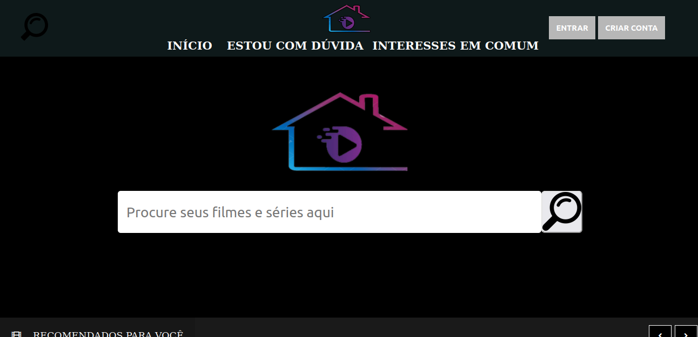
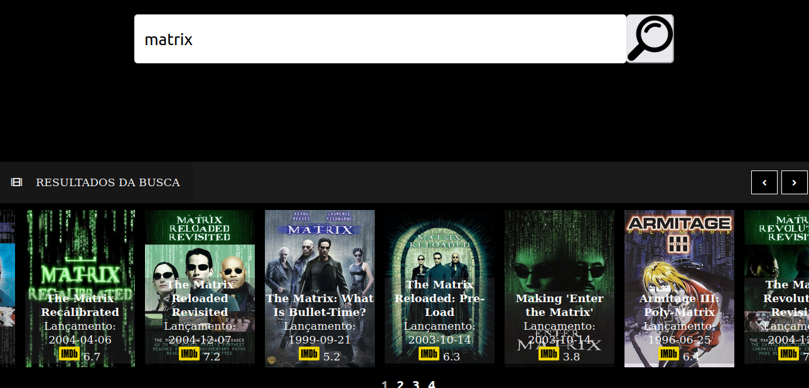
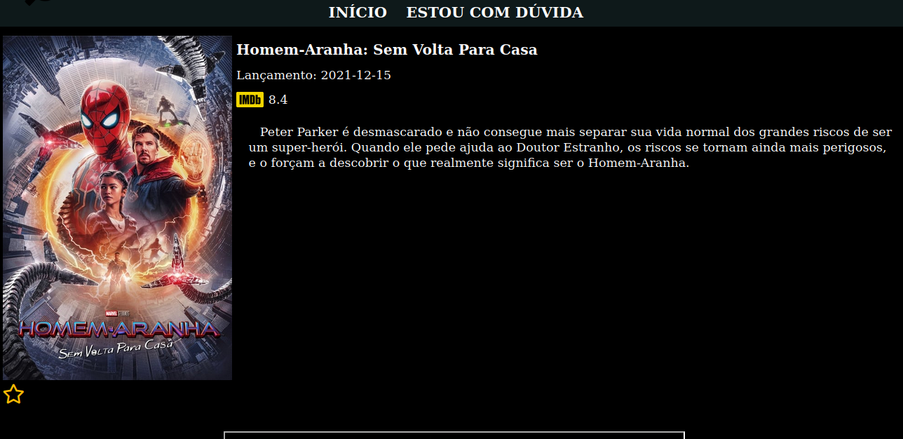
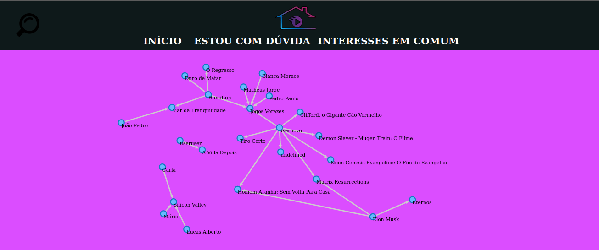

# Watch At Home

**Número da Lista**: 1<br>
**Conteúdo da Disciplina**: Grafos 1<br>
**Vídeo de apresentação: <a href="https://drive.google.com/file/d/1m7lENdZkwiN34PFnJjZ9CIy74oIW4qeI/view?usp=sharing">Assistir</a>

## Alunos
|Matrícula | Aluno |
| -- | -- |
| 18/0023411  |  Maicon Lucas Mares de Souza |
| 18/0018574  |  Hérya Rodrigues Alcantara |

## Sobre 
O Watch At Home é uma aplicação de recomendação de filmes e séries em que os usuários podem favoritar aqueles que mais gostam. Utilizando grafos, a aplicação mostra aos usuários quais outros perfis têm interesses similares.

## Screenshots










## Instalação 
**Linguagem**: JavaScript<br>
**Framework**: <br>

* Pré-requisitos:
  * [Git](https://git-scm.com/)
  * [NodeJS](https://nodejs.org/en/)
  * [NPM](https://docs.npmjs.com/downloading-and-installing-node-js-and-npm)
  
 
 * Clonar o repositório
 
  * Instalar dependências
  ```bash
  npm install
  ```
  
 * Executar o projeto
  ```bash
  npm run dev
  ```
  
  * Acessar a aplicação
  ```
  http://localhost:8080/
  ```
  ## Uso
  Ao acessar a aba "Interesses em comum" é necessário realizar o download do arquivo **graph.json** disponibilizado. O arquivo deve ser movido para a pasta "**public**" do projeto, substituindo o arquivo **graph.json** original. 

